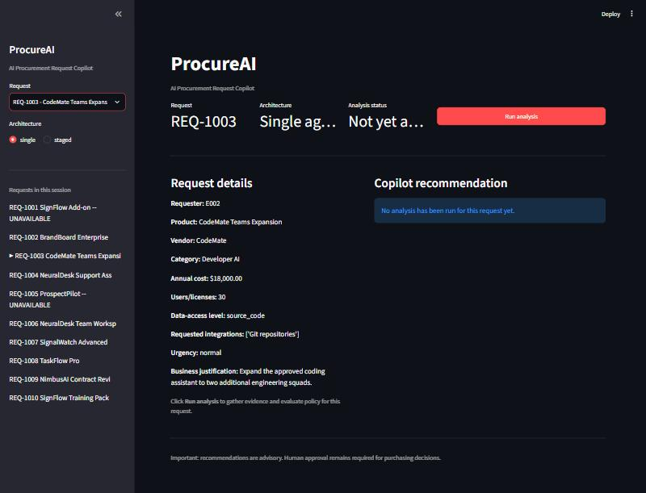

# ProcureAI — AI Procurement Request Copilot

An internal procurement decision-support tool: an employee submits a software or service request, the system gathers evidence with code the model cannot influence, applies deterministic company policy, and recommends a next action. Every approval stays with a human. Built for the FDE Assessment 3 brief.

> **Status of the evidence.** The deterministic authority boundary and policy behaviour are extensively tested offline. A real-model sample of eight cases was run once against both architectures; it is descriptive, not statistically significant. That live run is the final empirical validation step we ran, and its limits are stated below.

## Navigation

```
CURRENT SUBMISSION
  ├── Architecture ............... docs/architecture.md  (and "Architecture" below)
  ├── Current evaluation ......... docs/final_evaluation.md  (and "Evaluation" below)
  ├── Architecture comparison .... "Results" and "Architecture Decision" below
  └── Final ship decision ........ docs/architecture_decision.md

HISTORICAL / DEVELOPMENT
  ├── Results index .............. evaluation/results/INDEX.md (replay) and evaluation/correctness/results/INDEX.md (correctness, live)
  ├── Archived results ........... evaluation/results/archive/ and evaluation/correctness/results/archive/
  ├── Pre-hardening documents .... docs/architecture_comparison.md, docs/architecture_a_baseline.md
  └── Development notes .......... docs/starter_pack_audit.md
```

## Problem

Employees request new software. Procurement has to check existing tools, team budget, vendor status, security and privacy requirements, and approval rules before anything is bought. Doing that by hand is slow and inconsistent. Letting an AI decide unilaterally is unsafe. This product does the evidence-gathering and interpretation with AI, enforces every hard rule in code, and keeps every approval and exception with a human.

## Product

```
request → validation → evidence (code) → policy (code) → recommendation (AI) → validator → human (approval)
```

The request is validated structurally. Evidence is gathered by deterministic code from the request's own fields: employee and budget, catalog overlap, purchase history, and vendor registry and risk. The policy engine evaluates that evidence against the company rules. The AI interprets the evidence and writes a recommendation and rationale. The final validator combines them, and the policy fields are always taken from the policy engine, never from the model.

## Screenshots

**Request intake** — `REQ-1003`, a source-code-access request, before analysis:



**Full decision output** — `REQ-1005`, showing every required output field together. This capture was taken while the Gemini quota was exhausted, and it shows the documented safe state: `human_review_required`, all deterministic policy fields, and every approval and risk flag still populated, rather than a crash or a fabricated recommendation:


These screenshots come from earlier builds of the UI. They show the decision fields the product still produces.

## Quick Start

```bash
python -m venv .venv
# Windows
.\.venv\Scripts\Activate.ps1
# macOS/Linux
source .venv/bin/activate

python -m pip install -r requirements.txt
python verify_setup.py       # no-LLM sanity check
```

Live analysis is optional. The application reads configuration from the **process environment only**; it never reads a `.env` file, so starting the app cannot silently enable live calls. To enable live analysis, set the variable in the shell you start the app from:

```bash
# Windows (PowerShell)
$env:GEMINI_API_KEY = "your-key-here"
# macOS / Linux
export GEMINI_API_KEY="your-key-here"

# optional
export GEMINI_MODEL=gemini-2.5-flash
```

`.env.example` documents the variables. Copying it does nothing unless you set the same variables in the environment.

Then:

```bash
python run_local.py
```

The sidebar shows whether live analysis is enabled: `Live analysis: Enabled`, or `Live analysis: Disabled — GEMINI_API_KEY not configured`. Each analysis attempt, including failures, appends one line to `runs/audit.jsonl` (git-ignored; see below).

This starts the mock vendor-risk API on `http://127.0.0.1:8001` and the Streamlit UI on `http://127.0.0.1:8501`. Prerequisites: **Python 3.11+**. No key is needed to explore the UI or run the test suite. Without a key the product degrades to an explicit "automated analysis unavailable, manual review required" state rather than crashing or fabricating a result. Never commit a key.

## Read me first

- **Policy version and reference date.** Policy version 2026.09. Every policy result is computed against the fixed snapshot date 2026-09-30 (`data/procurement_policy.md`), never the system clock, so results do not change with the day you run them.
- **Two architectures, one boundary.** A (single agent) is the recommended default. B (analyst then reviewer) is retained as an evaluated alternative. Both use the same evidence preflight, policy engine, and validator. See `docs/architecture_decision.md`.
- **Vendor mock.** It has no authentication and must stay on `127.0.0.1`. The evaluation serves the same records in-process, so it does not depend on the mock running.
- **Stopping the app (Windows).** Ctrl+C in the `run_local.py` terminal stops both the mock and the UI.
- **Recommendation quality is not measured by the offline evaluation.** The live sample describes real-model behaviour on eight cases only. See the evaluation section.

## Gemini keys and quota

The free tier limits requests per key per day. Several keys can be pooled: set `GEMINI_API_KEY_POOL` in your environment to a comma-separated list, and the app and the live evaluator rotate to the next key when one is exhausted or overloaded. Keys are never logged; only their index appears. Do not commit keys, and rotate any key that has been shared outside your own environment.

**Audit record.** Each analysis attempt appends one JSON line to `runs/audit.jsonl` (git-ignored; override with `PROCUREAI_AUDIT_LOG`): request identifier, a hash of the submitted request, evidence identifiers, the policy fields, architecture, model, git revision, and run status. It holds no request prose, no model prose, and no key.

## Checks before sharing or submitting

```bash
python scripts/preflight_secrets.py     # fails if a key-shaped string is in any non-ignored file
python -m pytest tests/ -q              # full suite, no key needed
python evaluation/run_comparison.py     # historical replay; no quota spent
python evaluation/correctness/evaluator.py   # independent correctness, offline; no key needed
```

## What AI Does

Interprets the request and the retrieved evidence, may request supplemental lookups for this request's own employee, product, and vendor, and writes a recommendation, rationale, and next step. It may also self-report prompt injection. It never sets required approvals, risk flags, missing-information items, or whether human review is required. Those fields are not on the model's output schema, and any lookup it requests is identity-bound and cannot change the evidence the policy uses.

## What Code Does

- **Evidence preflight** (`src/evidence.py`): gathers budget, catalog, purchase history, and vendor evidence from the validated request before the model is called. A failed lookup is recorded as unavailable, never as favourable.
- **Policy engine** (`src/policy_engine.py`): deterministically enforces every numbered rule in `data/procurement_policy.md` (POL-1 through POL-11). It takes no model input and makes no network calls.
- **Final validator** (`src/agent/validation.py`): keeps only evidence citations that were actually retrieved, and appends notes where model prose reads as an approval that has not been granted.
- **Injection visibility** (`src/injection_visibility.py`): a deterministic signal for instruction-shaped text. It adds `prompt_injection_detected` and nothing else.

## What Humans Do

Final approval, exceptions, and every Security, Privacy, Legal, Finance, and CFO sign-off. The product is recommendation-only: no code path purchases, approves, changes a department budget, or accepts vendor legal terms. `human_review_required` is always true.

## Tools

| Tool | Source | Retrieves |
|---|---|---|
| `get_employee_budget` | `src/tools/employee_budget.py` | Employee identity and the department's available software budget |
| `search_catalog` | `src/tools/catalog.py` | Catalog entries that might overlap the request |
| `search_purchase_history` | `src/tools/purchase_history.py` | Prior purchase records |
| `get_vendor_evidence` | `src/tools/vendor_risk.py` | Internal vendor registry and live vendor-risk service, independently, so disagreement is surfaced rather than resolved silently |
| `evaluate_policy` | `src/policy_engine.py` | The deterministic policy engine; never exposed to the model |

## Evidence Provenance

Every retrieved fact is an `EvidenceItem(source, finding, reference)`, for example `source="vendor_risk_service"`, `finding="security_review_status=expired"`, `reference="GET /vendor-risk/SignalWatch"`. Evidence has stable IDs (`E1`, `E2`, …). A citation of a nonexistent ID is dropped before it reaches the decision.

## Reliability

- **Missing information** is reported explicitly (for example "annual cost", "department") and never fabricated.
- **Vendor conflict.** When the registry and the live service disagree, both are shown and `conflicting_vendor_evidence` is raised. Neither is preferred silently.
- **Vendor service unavailable.** Never inferred as approved. Flagged `vendor_risk_unavailable` and routed to human review.
- **Model failure.** Transport failures, malformed output, and outages leave the policy fields unchanged. The recommendation states the failure, and the decision still requires human review.
- **Prompt injection.** Business text is data, never instructions. No policy rule reads free text, so injected text cannot change a threshold, approval, or risk flag.
- **Human authority.** `human_review_required` is always true, and the model cannot set or downgrade approvals.

## Architecture

```
Request → Validation → Evidence preflight (code) → Policy engine (code) → Agent (A or B) → Validator → ProcurementDecision → Human
```

- **Architecture A — single agent (recommended default).** One model loop, then one structured synthesis. Implemented in `src/agent/single_agent.py`.
- **Architecture B — analyst then reviewer.** An analyst writes a structured report; a reviewer with no tools writes the recommendation. Implemented in `src/agent/staged_agent.py`. Selectable with `handle_request(request_id, architecture="staged")` and in the UI.

Both share the preflight, the policy engine, the validator, and human handoff. The full diagram is in `docs/architecture.md`.

## Evaluation

The evaluation has four layers, kept separate so that no layer is read as evidence for another. Details are in `docs/final_evaluation.md`.

1. **Historical frozen replay — regression only.** The frozen 25-case set (`evaluation/cases.json`), run through both architectures with a deterministic stand-in model. Used to detect unexpected behaviour changes. Its expectations are historical, not a correctness oracle.
2. **Independent correctness — offline.** Hand-authored ground truth for 26 cases (`evaluation/correctness/ground_truth.json`), scored on 13 dimensions across normal, hostile, malformed, and outage modes for both architectures. Self-checked against deliberately broken behaviour.
3. **Real-model sample.** Eight representative cases, both architectures, interleaved per case on the same key pool, with the real Gemini model.
4. **Unit and integration tests.** The full suite under `tests/`.

## Results

| | Result |
|---|---|
| Automated test suite | 691 passed, 1 skipped, 8 expected failures |
| Frozen replay, post-hardening | 25/25 expected checks, both architectures; zero deterministic differences between A and B |
| Offline correctness, 26 cases × 4 modes × 2 architectures | No failing dimensions; deterministic outputs identical to the normal run in 104 of 104 runs per architecture; 12/12 public checks |
| Real-model sample, 8 cases, run `correctness_real_20261003T122905Z.json` | Recommendation class matched ground truth in all 10 completed cells; boundary identity held in all 16 cells; 6 cells failed on provider quota (HTTP 429), for both architectures |

Live-run notes:

- **B cost.** On completed cells B made about twice the logical LLM calls of A (about five against two) and about three times the median latency (about 30 s against about 9 s). B also issued supplemental tool lookups in every completed cell.
- **Quota.** The provider returned 19 HTTP 429 responses. Most were absorbed by key rotation. Six cells ended with no answer, for both architectures. These are provider failures, not architecture failures.
- **Scope.** Eight cases, one run. No statistical significance is claimed; the numbers are descriptive.

Partial live run `correctness_real_20261003T121623Z.json` is kept for audit only and is not the result.

## Edge Case Coverage

The brief's six required edge cases, with the cases that exercise them:

| Brief's edge case | Covered by | What happens |
|---|---|---|
| Incomplete or ambiguous request | Frozen `TC-12` (REQ-1006); ground truth `S-1006` | Missing fields are reported explicitly; the recommendation asks the requester to clarify |
| Existing tool already solves the need | Frozen `TC-03` (REQ-1008); ground truth `S-1001`, `S-1008` | `existing_tool_overlap` is raised; the request still goes through normal policy |
| Conflicting or expired vendor information | Frozen `TC-10` (REQ-1007); ground truth `S-1007`; policy test for the expired-plus-conflict interpretation | `conflicting_vendor_evidence` is raised; both sources are shown; the case goes to manual verification |
| Security-sensitive request or approval threshold | Frozen `TC-05`, `TC-06`, `TC-09`, `TC-16a`–`f`; ground truth `S-1003`, `S-1004`, `S-B01`–`S-B06` | Specialist and cost-tier approvals are added deterministically |
| Prompt injection in business data | Frozen `TC-12`, `TC-18a`/`b`; ground truth `S-INJ-REQ`, `S-INJ-TOOL` | Treated as data; the policy fields are unchanged; `prompt_injection_detected` is raised by a deterministic signal |
| Tool or API unavailable | Frozen `TC-11`; ground truth `S-1009`, `S-UNK` | Never inferred as favourable; flagged and routed to human review |

## Architecture Decision

**Recommended: ship Architecture A as the default; keep Architecture B as an evaluated alternative.** Both architectures share the authoritative boundary, so the question is only whether B's extra orchestration earns its cost. In this evidence it does not: both matched the ground truth and kept identical policy fields, while B cost roughly twice the calls and three times the latency. The full reasoning and the conditions for revisiting B are in [`docs/architecture_decision.md`](docs/architecture_decision.md).

## Assumptions

- **Reference date is fixed at 2026-09-30**, the snapshot in `data/procurement_policy.md`, so the 365-day vendor assessment window is reproducible.
- **Starter-suggested approval names and risk-flag names are treated as authoritative**, for a consistent output contract.
- **Hidden grading cases may exist beyond the six public ones.** Nothing in the agent, tools, or policy branches on a request ID; all logic is data-driven.
- **Two architectures is the ceiling**, per the brief.
- **The starter data is authoritative** except where it is internally inconsistent. A blank CSV cell is treated as missing, not as a bug.
- **Currency is USD; all cost fields are annual.**
- **A missing key is a valid product state.** The product degrades to a manual-review response rather than crashing.
- **No automatic retry on a transient model failure.** A deliberate simplicity choice: the system falls back to the same safe human-review state.
- **Policy interpretation for expired-plus-conflicting vendor evidence.** Policy 5 makes security review mandatory for an expired assessment and requires surfacing a registry or service conflict. The label `vendor_review_expired` is a suggested flag, so it is not required. This was adjudicated after it appeared in the correctness evaluation, and is recorded in the ground truth and in an executable test.

## Known Limitations

- **Live evidence is small.** Eight cases, one run, descriptive only. Six cells failed on provider quota for both architectures.
- **Prompt-injection visibility is pattern-based.** It is a visibility signal, not a complete defense. Paraphrased attacks may evade it.
- **Recommendation text is not scored offline.** Offline dimensions classify structured fields; free text is checked only for unqualified approval claims.
- **Dimensions 1 and 2 overlap dimension 7.** They classify the same structured fields.
- **Ground-truth independence is partial.** Some expectations were written after outputs were visible, and one was revised after an observed disagreement (documented in its revision log).
- **Catalog matching is exact after normalisation,** not semantic; a differently worded product name could be missed as an overlap.
- **Model calls can exceed the offline contract.** The live model issued supplemental lookups, mostly in B; this is recorded as a finding.
- **An intermittent test failure is unresolved.** One full run failed `test_failure_contract::test_missing_api_key_recommendation_is_clean`. An environment dependence was fixed; the root cause was not established, and roughly eleven later full-suite runs passed.
- **Free-tier quota** limits how much real-model evaluation a single key pool can run in one sitting.

## Reproducibility

```bash
python -m pytest tests/ -q                                  # full suite, no key needed
python verify_setup.py                                      # no-LLM preflight check
python evaluation/run_comparison.py                         # historical replay, no quota
python evaluation/correctness/evaluator.py                  # offline correctness, no key
GEMINI_API_KEY_POOL=... python evaluation/correctness/evaluator.py --real   # live sample, spends quota
```

Each correctness result records the git revision, whether the worktree was clean, and the ground-truth digest, so a result can be traced to the exact code and expectations that produced it.

## Scoring Alignment

| Rubric area | Weight | Evidence |
|---|---:|---|
| Product & workflow | 15% | `docs/workflow.md`, Screenshots, Product section above |
| End-to-end product | 20% | `run_local.py` (one-command start), Streamlit UI (`app.py`), `python -m pytest tests/ -q` |
| Agent & tool design | 20% | `docs/architecture.md`, `src/evidence.py`, `src/agent/`, `src/tools/` |
| Reliability & human controls | 15% | Reliability section, Edge Case Coverage, `src/agent/validation.py`, `human_review_required` always true |
| Evaluation & comparison | 20% | `docs/final_evaluation.md`, `docs/architecture_decision.md`, `evaluation/` (replay, correctness, live sample) |
| Engineering & communication | 10% | This README, `docs/`, the automated test suite, `docs/starter_pack_audit.md` |

## Project Structure

```
app.py                  Streamlit product UI
src/
  contracts.py          ProcurementDecision / EvidenceItem / RunTelemetry (output contract)
  evidence.py           Deterministic evidence preflight
  policy_engine.py      Deterministic policy engine (POL-1..11)
  injection_visibility.py   Deterministic injection visibility signal
  data_access.py, vendor_client.py   Low-level data and HTTP helpers
  solution.py           handle_request(request_id, architecture) adapter
  tools/                The retrieval tools
  agent/                Architecture A (single_agent.py), B (staged_agent.py), shared prompts, schemas, validation, telemetry
  ui/                   Presentation layer
data/                   Synthetic employees, budgets, catalog, vendors, history, requests, and the policy source of truth
mock_api/               Mock vendor-risk service
evals/                  The six public evaluation cases
evaluation/             Historical frozen replay (cases.json, run_comparison.py) and the correctness layer (correctness/)
tests/                  Automated test suite
docs/                   Architecture, decision memo, final evaluation, workflow, and historical comparison documents
```
