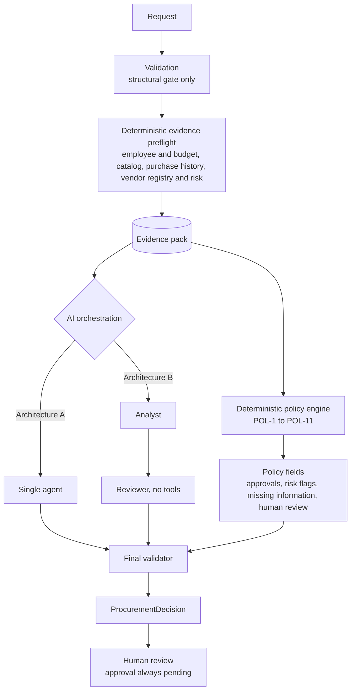

# AI Procurement Request Copilot

An internal decision-support tool for procurement. An employee submits a software or service request. Deterministic code gathers the evidence (budget, existing tools, purchase history, vendor status) and evaluates company policy. An AI agent interprets that evidence and recommends the next action. A human makes every approval and exception decision. The system never approves, purchases, changes a budget, or accepts vendor terms.

Built for FDE Assessment 3 ([brief](docs/Assignment_3_Brief.pdf)). The synthetic dataset and policy come from the starter pack.

## What this demonstrates

- **Evidence-backed recommendations.** Every claim cites an evidence ID that a tool actually retrieved. Citations to IDs that were never retrieved are dropped.
- **Deterministic policy enforcement.** Eleven numbered policy rules run in code (POL-1 to POL-11, with sub-rules POL-4a to POL-4d). The model has no input to them.
- **Human handoff for sensitive decisions.** `human_review_required` is always true. Approvals are always shown as pending.
- **Architecture chosen by evidence, not intuition.** A single agent (A) and a two-agent staged variant (B) were run on the same test sets. A pre-registered decision rule selected A.

## 1. Problem

Before software is bought, procurement must check:

- whether an existing tool already covers the need,
- the requesting team's available budget,
- the vendor's status (internal registry and live security review),
- security, privacy, and legal requirements,
- the approval thresholds that apply to the cost, and
- whether the request is missing information.

Doing this by hand is slow and inconsistent. Letting an AI decide alone is unsafe. This product gathers the evidence, applies the rules, and recommends the next action. A person decides what happens next.

## 2. What the product does

1. **Select a request.** The sidebar lists the ten synthetic requests (`REQ-1001` to `REQ-1010`). Choose the architecture (single or staged).
2. **Review request details.** Requester, department, product, vendor, category, annual cost, users or licences, data-access level, integrations, urgency, and business justification. A missing value is shown as "Missing", never as blank or null.
3. **Run analysis.** Evidence is retrieved, the policy is evaluated, and the model writes a recommendation. Each step is recorded in the run details.
4. **Read the result.**
   - **Recommendation** with its rationale and the policy constraints behind it.
   - **Vendor security** for the registry status and the live vendor-risk status, shown side by side.
   - **Evidence**: each item has a stable ID (E1, E2, …), a source, a finding, and a reference to the file or endpoint it came from.
   - **Policy checks**: each POL rule as PASS, REQUIRED, or SKIPPED, taken directly from the policy engine.
   - **Approvals required**, **risk flags**, **missing information**, and **next step**.
5. **Human review.** When review is needed (always, in this product), the UI shows the reason, the required reviewers, the statement that no approval was executed, and a handoff summary that can be copied into a review tool.


The other captures are in `docs/images/`. They include the sidebar live status, staged and single intake, both audit trails, and the evidence panel.

## 3. Quick start

Requirements: **Python 3.11** and Git. No API key is needed to run the UI or the test suite.

```bash
git clone https://github.com/Ujjwaljain16/Procure-AI.git
cd Procure-AI
python -m venv .venv
```

Activate the environment:

```bash
.\.venv\Scripts\Activate.ps1
```

On macOS or Linux, use `source .venv/bin/activate` instead.

Install the dependencies and run the setup check:

```bash
python -m pip install -r requirements.txt
```

```bash
python verify_setup.py
```

Start the application. This one command starts the vendor-risk API and the UI:

```bash
python run_local.py
```

Open **http://127.0.0.1:8501**. The vendor-risk API runs on `http://127.0.0.1:8001`. Press Ctrl+C in the terminal to stop both.

### Optional: live model analysis

Without a key, the app works, and an analysis shows an explicit "automated analysis unavailable, manual review required" state. To enable live analysis, set a key in the shell you start the app from. The app reads configuration from the process environment only. It never reads a `.env` file.

Direct Gemini:

```bash
# Windows (PowerShell)
$env:GEMINI_API_KEY = "your-key-here"
```

```bash
# macOS / Linux
export GEMINI_API_KEY="your-key-here"
```

Gemini models through CloseRouter (OpenAI-compatible endpoint), used for the final evaluation:

```bash
# Windows (PowerShell)
$env:CLOSEROUTER_API_KEY = "your-key-here"
```

```bash
# macOS / Linux
export CLOSEROUTER_API_KEY="your-key-here"
```

The optional variables are `GEMINI_MODEL` (default `gemini-2.5-flash`), `GEMINI_API_KEY_POOL` (comma-separated keys, rotated when one is exhausted), `CLOSEROUTER_MODEL` (default `google/gemini-3.7-flash`), and `CLOSEROUTER_BASE_URL` (default `https://api.closerouter.dev/v1`). If `GEMINI_API_KEY` or `GEMINI_API_KEY_POOL` is set, the app uses Gemini. Otherwise, if `CLOSEROUTER_API_KEY` is set, it uses CloseRouter.

The sidebar shows the state: `Live analysis: Enabled` or `Live analysis: Disabled — GEMINI_API_KEY not configured`.


`.env.example` lists the variable names with empty values. It is reference only. Never commit a key. Run `python scripts/preflight_secrets.py` to check for key-shaped strings before sharing.

## 4. Architecture

The governing rule is that **the model never chooses the evidence the policy uses**. All facts that feed a policy decision come from deterministic code, gathered from the validated request before any model turn.



| Layer | What it does | Where |
|---|---|---|
| **Code** | Validates the record, gathers the evidence pack, evaluates the policy, sets the approvals, flags, missing information, and the human-review flag, and validates the model's output | `src/evidence.py`, `src/policy_engine.py`, `src/agent/validation.py` |
| **AI** | Interprets the evidence, may request supplemental lookups for this request's own employee, product, or vendor, and writes the recommendation, rationale, and next step. It may also self-report prompt injection | `src/agent/single_agent.py`, `src/agent/staged_agent.py` |
| **Human** | Final approval, exceptions, and every Security, Privacy, Legal, Finance, and CFO sign-off | Handoff in the UI |

The model's output schema has no field for approvals, risk flags, missing information, or human review. A supplemental lookup the model requests is bound to the request's own identifiers. A lookup for a different employee, product, or vendor is rejected (`src/agent/tools_registry.py`).

### Tools

| Tool | Deterministic | Retrieves |
|---|---|---|
| `get_employee_budget` | Yes | Employee identity, department, and the department's available software budget |
| `search_catalog` | Yes | Catalog entries that might overlap the request |
| `search_purchase_history` | Yes | Prior purchase records |
| `get_vendor_evidence` | Yes | The internal vendor registry and the live vendor-risk service, reported separately so that disagreement is surfaced rather than resolved silently |
| `evaluate_policy` (internal) | Yes | The policy engine. It is never exposed to the model |

Each retrieved fact is an evidence item (`source`, `finding`, `reference`). A failed lookup is recorded as unavailable, never as a favourable result. The vendor-risk service is a local mock (`mock_api/app.py`) with no authentication. It binds to `127.0.0.1`.

### Output

Every analysis returns a `ProcurementDecision` with these fields:

- `recommendation`
- `evidence`
- `required_approvals`
- `missing_information`
- `risk_flags`
- `next_step`
- `human_review_required` (always true)
- `telemetry` (architecture, model, logical LLM calls, HTTP attempts, tool calls, latency)

### Architecture A and B

Both architectures share the preflight, the policy engine, the validator, and the handoff. They differ only in orchestration.

| | **A: single agent (shipped)** | **B: analyst, then reviewer** |
|---|---|---|
| Model stages | One tool loop, then one structured synthesis | Analyst (may use tools) writes a structured report. Reviewer (no tools) writes the recommendation |
| Live median logical LLM calls | 3 | 4 |
| Live median latency | 18.2 s | 24.4 s |
| Live recommendation and next action | 16 of 16 | 16 of 16 |
| Live evidence grounding | 16 of 16 | 16 of 16 |


## 5. Evaluation

The evaluation has four layers. Each answers a different question, and no layer is read as evidence for another. The full method is in [`docs/final_evaluation.md`](docs/final_evaluation.md).

| Layer | Question | Scope | Result |
|---|---|---|---|
| 1. Frozen replay | Did the redesign change behaviour that was already accepted? | 25 frozen cases, both architectures, deterministic stand-in model. Regression only | 25 of 25 expected checks for both. Zero deterministic-field differences between A and B |
| 2. Independent correctness (offline) | Are the decisions correct, and do they hold under controlled failures? | 26 hand-derived cases × 4 modes (normal, hostile, malformed, outage) × 2 architectures, scored on 13 dimensions | No failing dimensions. Deterministic outputs identical to the normal run in 104 of 104 runs per architecture. 12 of 12 public checks |
| 3. Real-model sample | Does the actual model behave acceptably, and does B earn its cost? | 16 pre-registered cases, both architectures, interleaved per case, `google/gemini-3.7-flash` through CloseRouter | See below |
| 4. Tests | Does the code do what it claims? | `tests/` | 766 passed, 1 skipped, 8 expected failures |

### Layer 3 in detail

The 16 cases were fixed in code before the run. They include all six public cases, overlap, conflicting and expired vendor evidence, an unknown vendor, security and privacy triggers, prompt injection in request and vendor text, the approval-threshold edges, the unavailable-vendor path, and an incomplete request. The decision rule was committed to [`docs/preregistration_b_rule.md`](docs/preregistration_b_rule.md) before the run. The model was changed by a dated amendment, recorded in the same file, because the earlier model's route was unavailable at the provider.

Result: `evaluation/correctness/results/correctness_real_20261003T142144Z.json`, git revision `07c5dd2`, clean worktree. All 16 cases were comparable, with no provider failures.

- Recommendation and next action: 16 of 16 for both architectures.
- Evidence grounding: 16 of 16 for both architectures.
- Deterministic and safety dimensions: no regression in B against A.
- Attempts counted at the HTTP boundary matched the transport: 32 of 32 checks, zero mismatches.

**The call-count dimensions did not pass in the live run.** Dimension d12 (logical LLM calls) and d13 (tool-call attempts) check against the offline call-count contract. The live model made more calls than that contract allows, in every case, in both architectures: 3 or 4 logical calls and 8 tool calls per case. The model issued supplemental lookups. Those lookups are identity-bound and cannot change any policy field. The offline contract did not predict them. This is reported as a finding, not as a pass.

Run details for one live analysis, single agent (three model calls, eight tool calls, 35.7 s), and the staged equivalent (five model calls, nine tool calls, 32.5 s):


Earlier live runs and failed attempts are indexed in [`evaluation/correctness/results/INDEX.md`](evaluation/correctness/results/INDEX.md). Failed attempts that ended in provider outage are archived and are not results.

## 6. Ship decision: Architecture A

**Ship Architecture A.** The decision is in [`docs/architecture_decision.md`](docs/architecture_decision.md) (under the 500-word limit).

- The pre-registered rule required B to show at least two more successful cases, or ten percentage points more, on the primary or secondary metric, with no regression. B showed neither. The rule therefore selects A.
- Both architectures matched the ground truth on every case, so B's extra orchestration produced no measured quality gain here. It cost about 6 seconds more per case (median) and one more model call.
- A is the simpler system, and on this evidence it performs as well as B.

**Conditions to revisit B.** A larger live sample that shows a repeatable gain on recommendation or evidence grounding. Or a future policy that needs a separate reviewer stage that a single agent cannot provide cleanly.

**What this does not show.** Sixteen cases and one run are descriptive. No statistical-significance claim is made.

## 7. Edge cases

The brief's six edge cases, with the ground-truth cases that exercise each one (`evaluation/correctness/ground_truth.json`):

| Brief's edge case | Ground-truth cases | Behaviour |
|---|---|---|
| Incomplete or ambiguous request | `S-1006` | Missing fields are reported explicitly. The recommendation asks the requester to clarify |
| Existing tool already solves the need | `S-1001`, `S-1008` | `existing_tool_overlap` is raised. This is not an automatic rejection. The request still goes through policy |
| Conflicting or expired vendor information | `S-1007` | `conflicting_vendor_evidence` is raised. Both sources are shown. The case goes to manual verification |
| Security-sensitive request or approval threshold | `S-1003`, `S-1004`, `S-B01` to `S-B06` | Specialist and cost-tier approvals are added deterministically, whatever the recommendation text says |
| Prompt injection inside business data | `S-INJ-REQ`, `S-INJ-TOOL`, `S-1006` | Treated as data. Policy fields are unchanged. `prompt_injection_detected` is raised as a visibility flag |
| Tool or API unavailable | `S-1009`, `S-UNK` | Never inferred as approved. Flagged and routed to manual review |

## 8. Assumptions

- **Policy version 2026.09.** The rules are in `data/procurement_policy.md`, and the engine implements them in `src/policy_engine.py`.
- **Reference date is fixed at 2026-09-30**, the snapshot in `data/procurement_policy.md`. Date-based checks, such as the 365-day vendor assessment window, use it. The system clock is never used, so results do not change with the day they are run.
- **Currency is USD. All cost fields are annual.**
- **Starter data is authoritative** except where it is internally inconsistent. A blank cell is treated as missing, not as a bug.
- **Starter-suggested approval and risk-flag names are authoritative.** This keeps the output contract consistent.
- **Policy interpretation for expired-plus-conflicting vendor evidence.** Policy 5 requires security review for an expired assessment and requires surfacing a registry or service conflict. The label `vendor_review_expired` is a suggested flag, not a required one. This was adjudicated after it appeared in the correctness evaluation. It is recorded in the case's revision log and in an executable test.
- **A missing key is a valid state.** The product shows a manual-review response and does not crash.
- **No automatic retry on a transient model failure.** The system falls back to the safe human-review state.
- **Two architectures is the ceiling**, as the brief recommends.
- **Hidden grading cases may exist.** Nothing in the agent, tools, or policy branches on a request ID.

## 9. Known limitations

- **Live evidence is small.** One run of 16 cases, descriptive only.
- **Live call-count contract not met.** See the layer 3 section: the model made more logical calls and tool calls than the offline contract expects, in every case, in both architectures.
- **Repeated evidence rows in the UI.** When the model re-requests a lookup, the evidence panel can show the same item twice (see `docs/images/10_evidence_panel_repeated_lookups.png`). The policy fields and approvals are computed once and are unaffected. The panel is not yet deduplicated.
- **Prompt-injection visibility is pattern-based.** It is a visibility signal, not a defence. Paraphrased attacks may evade it.
- **Recommendation text is not scored offline.** Offline dimensions classify structured fields. Free text is checked only for unqualified approval claims.
- **Some ground-truth expectations were written after outputs were visible.** One was revised after a disagreement, and the revision is logged.
- **Catalog matching is exact after normalisation,** not semantic. A differently worded product name can be missed as an overlap.
- **Synthetic data only.** No real vendor, identity, or procurement system is integrated.
- **No persistence of decisions.** Each analysis appends one line to `runs/audit.jsonl` (git-ignored). Approvals are not recorded anywhere.
- **No authentication.** The UI and the vendor-risk mock bind to loopback by default. Binding elsewhere needs the explicit `PROCUREAI_ALLOW_EXTERNAL=1` opt-in, and then an authenticating reverse proxy must be placed in front.
- **Provider availability and quota.** Live runs depend on a provider's route and quota. Provider failures are recorded as provider failures, not architecture failures.
- **An intermittent test failure is unresolved.** One full run failed `test_failure_contract::test_missing_api_key_recommendation_is_clean`. An environment dependence was fixed and the root cause was not established. Later full runs passed.

## 10. Reproducibility

```bash
python -m pytest tests/ -q
```

```bash
python verify_setup.py
```

```bash
python evaluation/run_comparison.py
```

Layer 1 (replay, no quota). Each run writes new timestamped files to `evaluation/results/`.

```bash
python evaluation/correctness/evaluator.py
```

Layer 2 (offline correctness, no key).

```bash
python evaluation/correctness/evaluator.py --real --provider closerouter
```

Layer 3 (live sample). This spends provider quota. It needs `CLOSEROUTER_API_KEY` set. Use `--provider gemini` with `GEMINI_API_KEY` to run the direct-Gemini path.

Each correctness result records the git revision, whether the worktree was clean, and the ground-truth digest, so a result can be traced to the exact code and expectations that produced it.

The final live run is also exported as one row per case and architecture, in the submission's results format (`evaluation/correctness/results/correctness_real_20261003T142144Z.csv`):

```bash
python evaluation/correctness/export_csv.py evaluation/correctness/results/correctness_real_20261003T142144Z.json
```

## 11. Repository structure

```
app.py                       Streamlit product UI
run_local.py                 One-command start: vendor-risk API and UI
verify_setup.py              Setup and data check (no LLM calls)
src/
  contracts.py               ProcurementDecision, EvidenceItem, RunTelemetry
  evidence.py                Deterministic evidence preflight
  policy_engine.py           Deterministic policy engine (POL-1 to POL-11)
  injection_visibility.py    Deterministic injection visibility flag
  audit.py                   Per-analysis audit record (runs/audit.jsonl)
  live_status.py             Live analysis status shown in the UI
  solution.py                handle_request(request_id, architecture)
  tools/                     Retrieval tools
  agent/                     Architecture A, Architecture B, prompts, schemas,
                             validator, tool registry, Gemini and CloseRouter adapters
  ui/                        Presentation layer
data/                        Synthetic employees, budgets, catalog, vendors,
                             purchase history, requests, and the policy
mock_api/                    Vendor-risk service (FastAPI, loopback)
evaluation/                  Layer 1 replay (run_comparison.py, cases.json)
                             Layer 2 and 3 correctness (correctness/)
evals/                       Six public cases and their runner
tests/                       Automated test suite
scripts/                     Documentation check and secrets preflight
docs/                        Architecture, workflow, decision memo, final evaluation,
                             pre-registered rule, starter-pack fixes, brief, screenshots
```

## Scoring alignment

| Rubric area | Weight | Where to look |
|---|---:|---|
| Product and workflow | 15% | Section 2, [`docs/workflow.md`](docs/workflow.md), `docs/images/` |
| End-to-end product | 20% | `run_local.py`, `app.py`, `python -m pytest tests/ -q` |
| Agent and tool design | 20% | Section 4, [`docs/architecture.md`](docs/architecture.md), `src/evidence.py`, `src/agent/`, `src/tools/` |
| Reliability and human controls | 15% | Sections 4 and 7, `src/agent/validation.py`, `human_review_required` always true |
| Evaluation and comparison | 20% | Sections 5 and 6, [`docs/final_evaluation.md`](docs/final_evaluation.md), [`docs/architecture_decision.md`](docs/architecture_decision.md) |
| Engineering and communication | 10% | This README, `docs/`, the test suite, `.github/workflows/ci.yml` |
