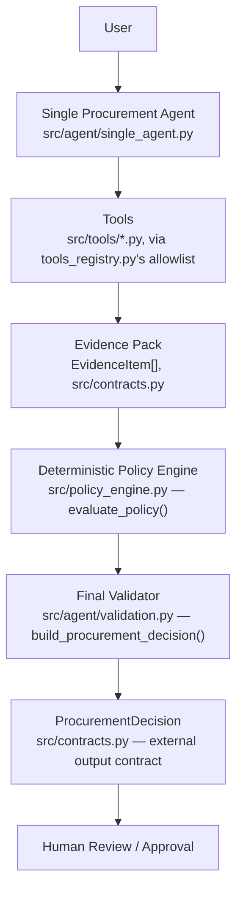
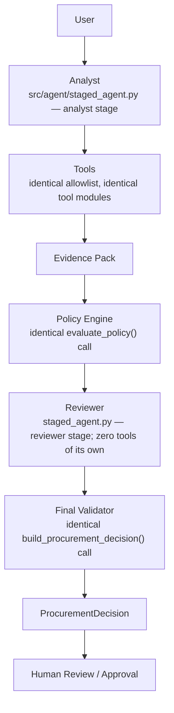

# Architecture

## Final shipped architecture (Architecture A — single agent)

See `docs/architecture_decision.md` for why this is the shipped choice.

## Architecture B (built and evaluated, not shipped)

Verified identical to A's tools/policy engine/validator by object-identity assertions (`tests/test_staged_agent.py::TestCrossArchitectureSharing`), not merely behavioral equivalence.

## Responsibility Boundary

| Layer | Responsibility |
|---|---|
| **AI** (single agent, or analyst+reviewer) | Interpret the request, select tools, synthesize evidence into a recommendation, rationale, and next step |
| **CODE** (`src/policy_engine.py`) | Thresholds, required-field checks, security/privacy/legal triggers, vendor-conflict/unavailability resolution, human-review requirement — deterministic, no LLM, no network |
| **HUMAN** | Every approval (Manager/Department Head/Finance/CFO/Procurement/Security/Privacy/Legal), every exception |

This boundary is enforced structurally, not just by convention: the model's output schema (`AgentSynthesis`) has no field for required approvals, risk flags, missing information, or human-review status — there is no code path through which the model could set or override any of them. `human_review_required` is a fixed constant in the policy engine's output construction, not a computed value.

## Evidence Boundary

- **Tools provide facts.** `src/tools/*.py` retrieve structured data and return it as `EvidenceItem` records, never a recommendation or a judgment.
- **Agents interpret.** The single agent (or analyst/reviewer pair) decides which tools to call and synthesizes what was retrieved into prose — but only ever *cites* evidence by ID, never invents it.
- **Policy engine enforces rules.** `evaluate_policy()` is the sole source of `required_approvals`, `risk_flags`, `missing_information`, and `human_review_required` in the final decision. It is never exposed to the model as a callable tool, so the model cannot decide whether a policy check "should" run.
- **Validator prevents unsafe model output from becoming final state.** `src/agent/validation.py::build_procurement_decision()` is the one place that combines model output with policy output: it drops any evidence citation that doesn't correspond to a real, retrieved `EvidenceItem`, falls back to a conservative "route to human review" state if the model's output is missing or malformed, and rewrites any recommendation text that reads as claiming an approval has already been granted. Both architectures call the identical function.
