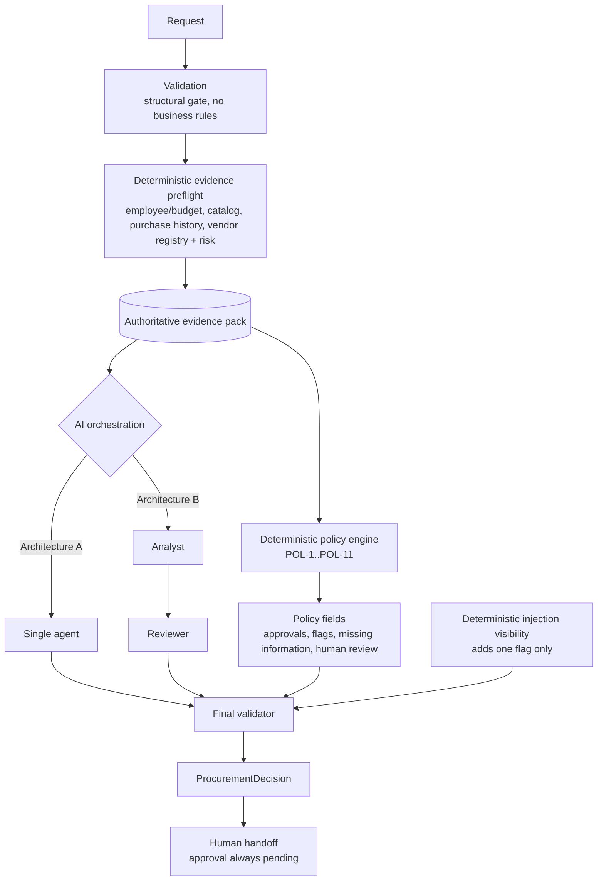

# Architecture

## The boundary

The product is built around one rule: **the model never chooses the evidence the policy uses.** Every fact that feeds a policy decision is gathered by deterministic code from the validated request, before any model turn. A model failure, a hostile model, or a malformed model cannot change the policy fields.

## What each part guarantees

- **Validation** rejects only structurally broken records (missing identifiers, non-numeric or non-finite cost). Negative cost is missing information, not a rejection. No business rule lives here.
- **Evidence preflight** (`src/evidence.py`) runs four lookups from request values only. A failed lookup is recorded as unavailable, never as a favourable result.
- **Policy engine** (`src/policy_engine.py`) takes no model input and makes no network calls. The same input always gives the same output.
- **AI orchestration.** The model may request supplemental lookups, but each is identity-bound to the request and cannot alter the evidence pack. The model's output schema has no field for approvals, flags, missing information, or human review.
- **Final validator** (`src/agent/validation.py`) checks evidence citations (only retrieved IDs are kept), appends correction notes where prose would read as an approval that has not been granted, and never removes policy fields.
- **Injection visibility** (`src/injection_visibility.py`) is a deterministic, pattern-based signal over request text and evidence. It adds `prompt_injection_detected` and changes nothing else. It is not a complete defense.
- **Human handoff.** `human_review_required` is always true. There is no code path that purchases, approves, changes a budget, or accepts legal terms.

## Architecture A and B

Both architectures use the same preflight, policy engine, validator, and handoff. They differ only in orchestration:

- **A (single agent, shipped default):** one model loop that may request supplemental lookups, then one structured synthesis.
- **B (analyst then reviewer):** an analyst stage that may request supplemental lookups and writes a structured report, then a reviewer stage with no tools that writes the recommendation.

Architecture B is retained as an evaluated alternative. See `docs/architecture_decision.md`.

## Telemetry

Logical LLM calls (what the orchestrator asked for) and actual HTTP attempts (what left the process, counted at the SDK boundary) are recorded separately. They differ when key rotation or retries occur, so reports never treat attempt counts as pure model-call counts.

## Source map

| Concern | Location |
|---|---|
| Output contract | `src/contracts.py` |
| Evidence preflight | `src/evidence.py` |
| Tool registry (identity binding) | `src/agent/tools_registry.py` |
| Policy engine | `src/policy_engine.py` |
| Architecture A | `src/agent/single_agent.py` |
| Architecture B | `src/agent/staged_agent.py` |
| Final validator | `src/agent/validation.py` |
| Injection visibility | `src/injection_visibility.py` |
| Gemini adapter and key pool | `src/agent/gemini_adapter.py`, `src/agent/key_pool.py` |
| Telemetry counter | `src/agent/attempts.py` |
