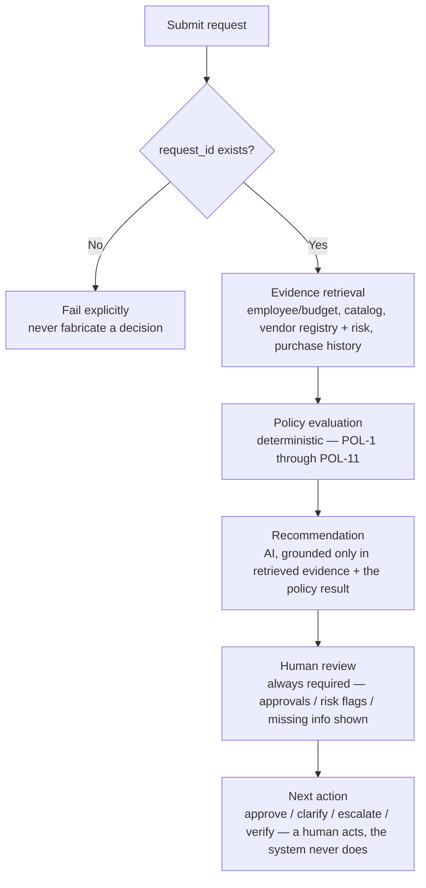

# Workflow

## User-visible flow

## Major branches

| Condition | System response |
|---|---|
| **Missing information** (e.g. cost, user count, department) | Reported explicitly as "Missing" in the UI (never `None`/`null`); flagged in `missing_information`; recommendation directs the requester to clarify rather than proceeding |
| **Existing tool already covers the need** | `existing_tool_overlap` flagged; the existing catalog entry is surfaced as evidence; **not** an automatic rejection — the recommendation may favor using the existing tool, but the request still proceeds through normal policy evaluation |
| **Vendor registry and live vendor-risk service disagree** | `conflicting_vendor_evidence` flagged; both sources shown side by side; routed to manual verification — neither source is silently preferred |
| **Vendor-risk API unavailable** | `vendor_risk_unavailable` flagged; never inferred as approved; routed to manual review |
| **Security / privacy / legal trigger** (source-code access, PII, cross-region storage, new vendor + spend threshold, etc.) | The corresponding specialist approval (Security / Privacy / Legal) is added to `required_approvals`, deterministically, regardless of what the AI's recommendation text says |
| **Prompt injection inside business data** (request justification, vendor/catalog notes) | Treated as data, never as an instruction; no policy-engine rule function reads free-text fields, so injected text cannot change a threshold, approval, or risk flag; the agent may additionally self-report `prompt_injection_detected` as a visibility-only signal |

## What the human sees at each stage

1. **Request details** — the raw submitted fields, with missing ones visually flagged.
2. **Evidence** — every fact the tools actually retrieved, each with its source and reference (file/API endpoint).
3. **Policy checks** — the POL-rule-by-POL-rule breakdown (PASS / REQUIRED / SKIPPED), read directly from the policy engine's output, never recomputed in the UI.
4. **Recommendation** — the AI's synthesis, clearly marked as advisory.
5. **Approvals required / risk flags / missing information** — always from the deterministic layer.
6. **Human review** — always shown; states the reason, the required reviewers, and that no purchase/approval/exception was executed by the AI.
7. **Handoff summary** — a copyable, structured summary generated from the decision's own fields (no second model call).
